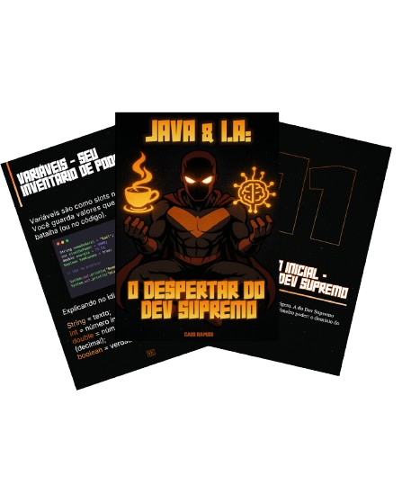

    

-------

# Projeto EBOOK Gerado por I.A.s

 > ℹ️ **NOTE:** Este é um projeto desenvolvido durante o Bootcamp **"Java and AI in Europe"** promovido pela [DIO](https://dio.me). O ebook ainda **não está 100% finalizado** e será aprimorado nas próximas semanas.

Este repositório tem como objetivo compartilhar um eBook digital criado com o apoio de ferramentas de Inteligência Artificial. Todo o conteúdo textual e visual foi desenvolvido a partir de prompts bem elaborados, que estão listados abaixo para quem quiser reproduzir ou adaptar a experiência.

📕<a href="LINK_PARA_SEU_PDF" title="Ver PDF">Clique aqui para ler o ebook</a>

## 💻 Tecnologias utilizadas no projeto

- [ChatGPT](https://chat.openai.com/) 
- [MidJourney](https://www.midjourney.com/app/)
- [PowerPoint](https://www.microsoft.com/en/microsoft-365/powerpoint)

## 🧠 Prompts usadod durante o projeto:

ChatGPT：

|   Ação   | prompt                                                                                                                                                                                                                                                                         |
| :------: | ------------------------------------------------------------------------------------------------------------------------------------------------------------------------------------------------------------------------------------------------------------------------------ |
|  título  | Crie um título de um ebook sobre o tema de Java e Inteligência Artificial. O título deve ser impactante, curto e atrativo para desenvolvedores. Liste 5 variações criativas.                                                                                                  |
| conteúdo | Escreva um texto introdutório de um ebook com foco em Java aplicado à IA, com linguagem acessível para quem está começando. Traga exemplos práticos e reais de como integrar bibliotecas de IA com Java. Use títulos claros e objetivos por seção.                          |

Microsoft Copilot：

|  Ação  | prompt                                                                                      |
| :----: | ------------------------------------------------------------------------------------------- |
| capa   | Futuristic developer coding with neural interfaces, hero tematic, HQ style --v 5.1 |

## ✨ Features

- Conteúdo textual gerado com ChatGPT
- Imagens originais via Microsoft Copilot
- Ebook diagramado com PowerPoint

## 📚 Estrutura do Repositório

- 📁 `assets` → imagens e recursos visuais
- 📁 `output` → versões geradas do ebook em PDF

## 🛠️ Como recriar

Utilize os prompts acima nas ferramentas recomendadas para gerar os textos e imagens. Em seguida, utilize uma ferramenta de diagramação como PowerPoint, Google Slides ou LibreOffice para montar seu ebook.

## 👨‍💻 Autor

    
    
&nbsp;&nbsp;&nbsp;Caio Ramos 
    &nbsp;&nbsp;&nbsp;
    <a href="https://github.com/CaiorrRamos">
    GitHub</a>&nbsp;|&nbsp;
    <a href="https://www.linkedin.com/in/caio-ramos-dev/">
    LinkedIn</a>
&nbsp;|&nbsp;
    <a href="#">
    Instagram</a>
&nbsp;|&nbsp;

  

---

Feito por [Caio Ramos](https://github.com/CaiorrRamos) 👨🏻‍💻
